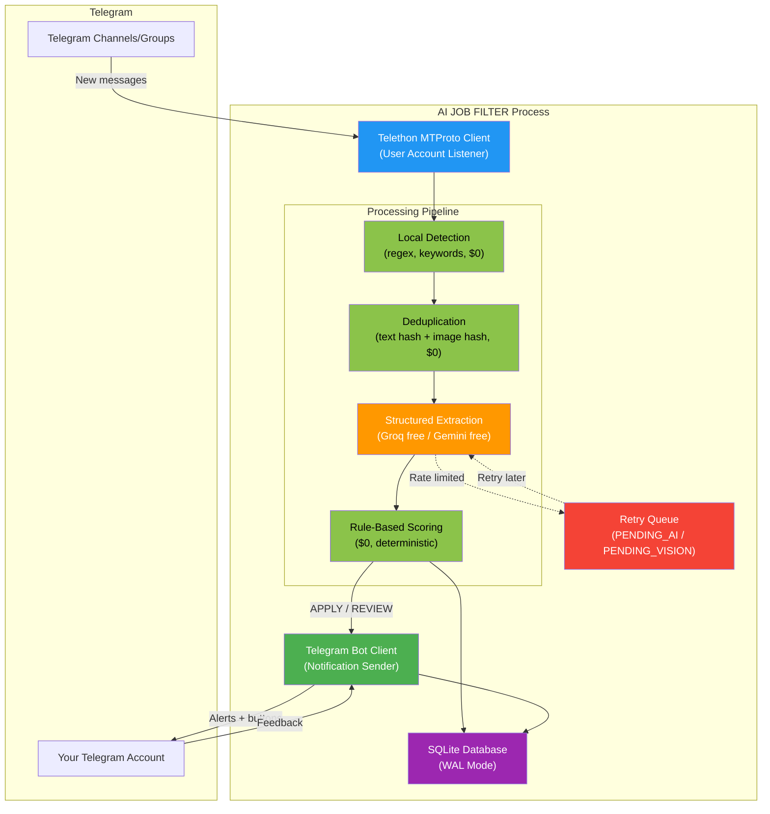
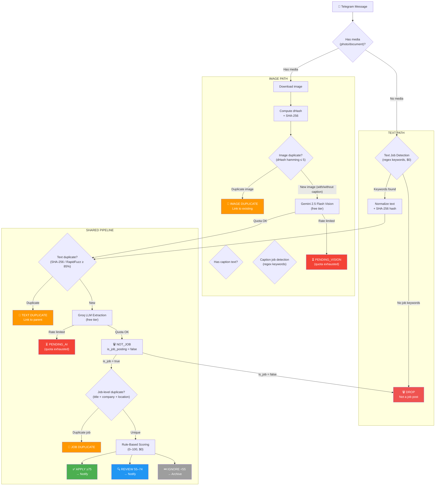
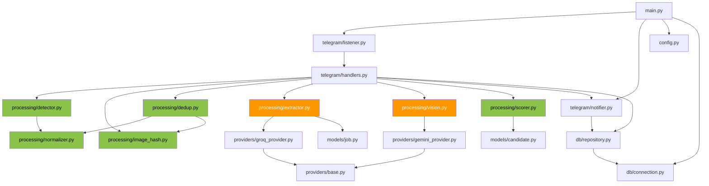
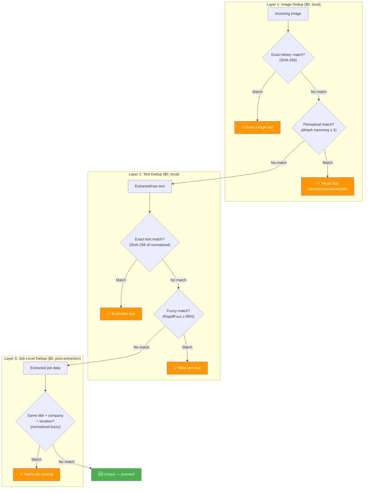

# AI JOB FILTER — Architecture Decision Record v1.2

**Version:** 1.2 (FREE-FIRST MVP)  
**Previous:** v1.1  
**Date:** 2026-08-21  
**Status:** APPROVED

---

## Changelog from v1.1

| # | Change | Rationale |
|:--|:-------|:----------|
| 15 | **Updated Vision model to Gemini 2.5 Flash** | `gemini-2.0-flash` replaced with `gemini-2.5-flash`; free-tier limits documented as assumptions, not guaranteed universal quotas |
| 16 | **Strict Job-Level Deduplication** | Primary identity: normalized title + company + location (all three required). Application URL is a strong supporting signal only when vacancy-specific. Generic career page URLs (`/careers`, `/jobs`) are excluded from URL-based dedup |
| 17 | **Codified static provider selection** | `TEXT_PROVIDER=groq`, `VISION_PROVIDER=gemini` are fixed for MVP. No automatic cross-provider fallback. Quota exhaustion → `PENDING_AI` / `PENDING_VISION`. Never silently call a paid provider |

---

## Changelog from v1.0

| # | Change | Rationale |
|:--|:-------|:----------|
| 1 | **Removed LiteLLM** | 30–50+ transitive dependencies; replaced with direct Groq SDK + google-genai SDK |
| 2 | **Removed OpenAI as MVP dependency** | Not free; now optional future adapter only |
| 3 | **Eliminated silent paid fallback** | Jobs queue as `PENDING_AI` / `PENDING_VISION` instead of auto-charging |
| 4 | **Fixed image-only pipeline** | Images no longer discarded when Telegram caption is empty |
| 5 | **Added image deduplication** | dHash/pHash perceptual hashing for poster dedup |
| 6 | **Removed `Staff` from negative keywords** | Indonesian "IT Staff" = entry-level position |
| 7 | **Nuanced experience matching** | Distinguishes "required" vs "preferred" vs "is a plus" |
| 8 | **Configurable scoring thresholds** | Via ENV: `MIN_SCORE_APPLY`, `MIN_SCORE_REVIEW` |
| 9 | **Configurable model names** | Via ENV: `TEXT_MODEL`, `VISION_MODEL` |
| 10 | **Added explicit error/processing states** | `PENDING_AI`, `PENDING_VISION`, `RATE_LIMITED`, etc. |
| 11 | **Updated candidate profile** | Added VMware, Kali Linux, penetration testing, bug bounty |
| 12 | **Minimal provider abstraction** | Simple Python protocol, not a framework |
| 13 | **Removed Instructor library** | Evaluate during implementation; may use direct JSON mode instead |
| 14 | **Verified all free-tier limits** | From official Groq and Google documentation |

---

## Table of Contents

- [A. Revised Architecture](#a-revised-architecture)
- [B. Revised Technology Choices](#b-revised-technology-choices)
- [C. Alternatives Considered](#c-alternatives-considered)
- [D. Why Each Choice Was Selected](#d-why-each-choice-was-selected)
- [E. Revised Data Flow](#e-revised-data-flow)
- [F. Component Diagram](#f-component-diagram)
- [G. Revised Database Schema](#g-revised-database-schema)
- [H. Telegram Authentication Model](#h-telegram-authentication-model)
- [I. LLM / Vision Strategy](#i-llm--vision-strategy)
- [J. Scoring Architecture](#j-scoring-architecture)
- [K. Image + Text Deduplication](#k-image--text-deduplication)
- [L. Security Model](#l-security-model)
- [M. Cost Model](#m-cost-model)
- [N. Testing Strategy](#n-testing-strategy)
- [O. MVP Scope](#o-mvp-scope)
- [P. Future Expansion](#p-future-expansion)
- [Q. Major Risks](#q-major-risks)
- [R. Free-Tier Assumptions and Limits](#r-free-tier-assumptions-and-limits)
- [S. Migration Path to Paid Providers](#s-migration-path-to-paid-providers)
- [T. Answers to Previous Open Questions](#t-answers-to-previous-open-questions)

---

## A. Revised Architecture

A **single-process, dual-client, tiered-pipeline** Python asyncio daemon designed around **$0 monthly operating cost**.

### Core Design Principles

1. **Free-first** — Every pipeline stage uses free/local processing; paid APIs are optional future adapters, never silent fallbacks
2. **Dual Telegram clients** — Telethon (MTProto user client) for ingestion; Bot API for notifications
3. **Image-aware** — Image-only messages are first-class citizens, never discarded
4. **Explicit cost control** — Free API quota exhaustion queues work as `PENDING_*`, never auto-charges
5. **SQLite-first** — No external database servers
6. **Deterministic scoring** — Rule-based, transparent, explainable; LLM extracts data, Python calculates scores
7. **Provider-swappable** — Model names and providers configured via environment, not hardcoded

### High-Level Architecture



> [!IMPORTANT]
> **Changed from v1.0:** The `EXTRACT` stage now queues to `PENDING_AI` / `PENDING_VISION` on rate limit instead of falling back to a paid provider. The user explicitly opts in to any paid provider.

---

## B. Revised Technology Choices

| Component | Technology | Version | Cost | Role |
|:---|:---|:---|:---|:---|
| **Runtime** | Python | 3.13 or 3.14 | Free | Application runtime |
| **Project Manager** | uv | 0.12+ | Free | Deps, venv, lockfile, scripts |
| **Telegram Ingestion** | Telethon | 1.44+ | Free | MTProto user client |
| **Telegram Notifications** | python-telegram-bot | 22.x | Free | Bot API alerts + feedback |
| **Primary LLM** | Groq (direct SDK) | 1.6+ | **Free tier** | Structured job extraction |
| **Vision / Images** | google-genai (Gemini 2.5 Flash) | 2.19+ | **Free tier** | Image → structured JSON |
| **Structured Output** | Pydantic v2 | 2.x | Free | Schema validation |
| **Database** | SQLite + aiosqlite | built-in + latest | Free | Async persistence, WAL |
| **Text Dedup** | RapidFuzz | 3.14+ | Free | Fuzzy text matching |
| **Image Dedup** | imagehash (or Pillow-only dHash) | 4.3+ | Free | Perceptual image hashing |
| **Configuration** | pydantic-settings | 2.4+ | Free | Typed `.env` loading |
| **Logging** | structlog | 24.x | Free | Structured logging |
| **Retry Logic** | tenacity | 9.x | Free | Backoff for API calls |
| **Linting** | Ruff | 0.6+ | Free | Linter + formatter |
| **Testing** | pytest + pytest-asyncio | 8.x + 0.24+ | Free | Async test framework |
| **Secret Detection** | gitleaks (pre-commit) | 8.x | Free | Prevent credential commits |

### What Was Removed from v1.0

| Removed | Reason |
|:---|:---|
| **LiteLLM** | 30–50+ transitive deps (~150MB), massive attack surface; direct SDKs are 3–5 deps each |
| **OpenAI SDK** | Not free; optional future adapter only |
| **Instructor** | Evaluate during implementation; may use Groq/Gemini JSON mode directly with Pydantic `model_validate_json()` instead |

---

## C. Alternatives Considered

### C1. LLM Provider Abstraction

| Option | Deps | Decision |
|:---|:---|:---|
| Direct Groq SDK + google-genai SDK | ~8 combined | **✅ Selected** — minimal, each <5MB |
| LiteLLM | 30–50+ (~150MB) | ❌ Rejected — disproportionate overhead for 2 providers |
| Custom HTTP calls | 0 | Viable but reinvents auth, retry, streaming |
| Instructor + from_groq | ~5 (light) | 🟡 Evaluate — may help with JSON validation retries |

### C2. Image Deduplication

| Option | Dependencies | Decision |
|:---|:---|:---|
| `imagehash` library | Pillow + numpy + scipy + PyWavelets (~100MB) | 🟡 Heavy but full-featured |
| Custom dHash (Pillow-only) | Pillow only (~2MB) | **✅ Preferred for MVP** — 20 lines of code, zero heavy deps |
| `dhash` package | Pillow only | ✅ Alternative — thin wrapper |
| OpenCV `img_hash` | opencv-python (~50MB) | ❌ Overkill |

### C3. Structured Output Strategy

| Option | Decision |
|:---|:---|
| Groq JSON mode + Pydantic `model_validate_json()` | **✅ Primary** — zero extra deps |
| Instructor `from_groq()` with auto-retry | 🟡 Evaluate — adds retry-on-validation-error |
| Manual prompt + regex JSON extraction | ❌ Fragile |

### C4. Experience Matching: "Staff" Keyword

| Approach | Decision |
|:---|:---|
| **v1.0:** Treat "Staff" as negative/senior keyword | ❌ **Wrong** — "IT Staff" is entry-level in Indonesia |
| **v1.1:** Contextual classification; only flag clearly senior titles | **✅ Corrected** |

---

## D. Why Each Choice Was Selected

### Direct SDKs over LiteLLM

**Verified fact:** LiteLLM pulls in 30–50+ transitive packages including `openai`, `tiktoken`, `tokenizers`, `aiohttp`, `jinja2`, `jsonschema`, totaling ~150MB+ disk space. The official `groq` SDK requires only `httpx`, `pydantic`, and `typing-extensions` (<5MB). For an MVP using 1–2 providers, direct SDKs are dramatically simpler.

### Groq Free Tier as primary LLM

**Verified fact (source: console.groq.com/docs/rate-limits):**
- Llama 3.3 70B: 30 RPM, **1,000 RPD**, 12,000 TPM, **100,000 TPD**
- 100,000 tokens/day ÷ ~1,100 tokens/job ≈ **90 jobs/day** — sufficient for MVP
- Returns HTTP 429 on quota exhaustion (no queuing, no charges)

### Gemini Free Tier for vision

**Current assumptions (source: ai.google.dev/pricing, verified August 2026):**
- Gemini 2.5 Flash: ~10 RPM, **~1,500 RPD**, 1,000,000 TPM
- Vision/image input: **YES** on free tier
- Images ≤384×384: **258 tokens**; larger: 258 tokens per 768×768 tile
- Structured output (`response_schema`): **YES** on free tier

> [!WARNING]
> **Free-tier quotas are not guaranteed universal values.** Actual RPM, RPD, and TPM limits are account-dependent, region-dependent, and subject to change by Google at any time. Always verify your project's current limits from the Google AI Studio dashboard or API response headers. The values above are current assumptions for planning purposes.

> [!WARNING]
> **Gemini Free Tier data policy:** On the free tier, Google logs prompts, inputs (including images), and outputs. These may be reviewed by human annotators and used to train models. Job posting data is generally public, but be aware of this policy. Paid tier disables this.

### No silent paid fallback

If Groq returns HTTP 429 or Gemini quota is exhausted:
1. Message is saved to SQLite with `processing_status = 'PENDING_AI'` or `'PENDING_VISION'`
2. A retry mechanism processes pending items when quota resets (daily at 00:00 UTC for Groq)
3. **No money is spent without explicit user configuration**

### Pillow-only dHash over imagehash

The `imagehash` library pulls in `scipy` and `PyWavelets` (~100MB compiled C/Fortran). A dHash implementation requires only Pillow and ~20 lines of Python. For MVP-level image deduplication, dHash alone is sufficient.

---

## E. Revised Data Flow

> [!IMPORTANT]
> **Key change from v1.0:** Image-only messages are no longer discarded. The pipeline branches on media presence, not on text keyword detection.



### Image-Only Message Handling (Fixed from v1.0)

```
Image-only message (no caption)
  → Download image
  → Compute dHash + SHA-256
  → Check image dedup (skip if duplicate)
  → Send to Gemini 2.5 Flash Vision (free tier)
    → Returns: is_job_posting, title, company, skills, contacts, etc.
  → If quota exhausted → PENDING_VISION (retry later)
  → If is_job_posting = true → text dedup → job-level dedup → score → notify
```

> [!IMPORTANT]
> **v1.0 bug fixed:** Image-only messages were discarded because Stage 1 regex required keywords in `raw_text` (which was empty). v1.1 branches on media presence first, then routes to the appropriate path.

### Caption + Image Handling

```
Caption + Image message
  → Download image
  → Check image dedup (skip if duplicate)
  → Send to Gemini 2.5 Flash Vision (free tier) with caption as additional context
    → Gemini analysis determines if it is a job posting
  → If quota exhausted → PENDING_VISION (retry later)
  → If is_job_posting = true → text dedup → job-level dedup → score → notify
```

> [!IMPORTANT]
> **Image Priority Rule (Correction 3):** We NEVER drop an image-containing message solely because its caption lacks job keywords. If an image is present, the message goes to the Vision API. The caption is provided as context, but the final determination of `is_job_posting` is made by Gemini based on the combined image + text evidence.

### Cost Gates Summary

| Stage | Cost | What It Prevents |
|:---|:---|:---|
| 1. Media branch detection | **$0** | Routes correctly before any processing |
| 2. Image dHash dedup | **$0** | Skips Vision API for duplicate posters |
| 3. Text regex detection | **$0** | Eliminates 60–80% of text messages |
| 4. SHA-256 + RapidFuzz text dedup | **$0** | Eliminates cross-posted duplicates |
| 5. Vision extraction (images only) | **Free tier** | Only new, non-duplicate images |
| 6. LLM extraction (text) | **Free tier** | Only likely-job, non-duplicate text |
| 7. Job-level dedup | **$0** | Catches semantically identical jobs |
| 8. Rule-based scoring | **$0** | Deterministic, no API calls |

---

## F. Component Diagram

### Project File Structure

```
ai-job-filter/
├── .env.example                 # Template for secrets (committed)
├── .gitignore                   # Comprehensive exclusions
├── .pre-commit-config.yaml      # gitleaks + ruff hooks
├── .python-version              # 3.13 or 3.14
├── pyproject.toml               # uv project config
├── uv.lock                      # Deterministic lockfile
├── README.md
├── GEMINI.md                    # Antigravity project instructions
├── candidate_profile.yaml       # Candidate skills/preferences
├── migrations/
│   └── 001_initial_schema.sql
├── src/
│   └── ai_job_filter/
│       ├── __init__.py
│       ├── main.py              # Entry point, asyncio loop, signal handling
│       ├── config.py            # pydantic-settings (.env loader)
│       ├── models/
│       │   ├── __init__.py
│       │   ├── job.py           # JobExtractionResult Pydantic schema
│       │   ├── candidate.py     # CandidateProfile dataclass
│       │   └── enums.py         # ProcessingStatus, Classification enums
│       ├── db/
│       │   ├── __init__.py
│       │   ├── connection.py    # aiosqlite connection factory + WAL setup
│       │   ├── repository.py    # Data access layer (CRUD)
│       │   └── migrations.py    # Schema versioning
│       ├── telegram/
│       │   ├── __init__.py
│       │   ├── listener.py      # Telethon MTProto listener
│       │   ├── notifier.py      # Bot API notification sender
│       │   └── handlers.py      # NewMessage event routing
│       ├── processing/
│       │   ├── __init__.py
│       │   ├── detector.py      # Regex/keyword job detection (local, $0)
│       │   ├── normalizer.py    # Text cleanup + SHA-256 hashing
│       │   ├── image_hash.py    # dHash perceptual hashing (local, $0)
│       │   ├── dedup.py         # Multi-tier dedup (text + image + job-level)
│       │   ├── extractor.py     # LLM structured extraction (Groq)
│       │   ├── vision.py        # Gemini 2.5 Flash image extraction
│       │   └── scorer.py        # Rule-based scoring engine
│       └── providers/
│           ├── __init__.py
│           ├── base.py          # TextProvider / VisionProvider protocols
│           ├── groq_provider.py # Groq SDK implementation
│           └── gemini_provider.py # google-genai SDK implementation
└── tests/
    ├── conftest.py
    ├── test_detector.py
    ├── test_normalizer.py
    ├── test_image_hash.py
    ├── test_dedup.py
    ├── test_scorer.py
    ├── test_extractor.py
    └── fixtures/
        ├── sample_job_posts.json
        └── sample_images/
```

### Module Dependency Graph



**Legend:** 🟢 Green = $0 local processing | 🟠 Orange = Free-tier API (with PENDING fallback)

---

## G. Revised Database Schema

```sql
-- ============================================
-- Pragmas (set on every connection open)
-- ============================================
PRAGMA journal_mode = WAL;
PRAGMA synchronous = NORMAL;
PRAGMA busy_timeout = 5000;
PRAGMA foreign_keys = ON;
PRAGMA cache_size = -64000;  -- 64MB

-- ============================================
-- 1. SOURCES: Monitored Telegram groups/channels
-- ============================================
CREATE TABLE IF NOT EXISTS sources (
    id                  INTEGER PRIMARY KEY AUTOINCREMENT,
    telegram_id         INTEGER UNIQUE NOT NULL,
    username            TEXT,
    title               TEXT NOT NULL,
    source_type         TEXT NOT NULL DEFAULT 'CHANNEL',  -- CHANNEL | GROUP
    is_active           INTEGER NOT NULL DEFAULT 1,
    created_at          TEXT DEFAULT (datetime('now')),
    updated_at          TEXT DEFAULT (datetime('now'))
);

-- ============================================
-- 2. MESSAGES: Raw Telegram messages (all types)
-- ============================================
CREATE TABLE IF NOT EXISTS messages (
    id                  INTEGER PRIMARY KEY AUTOINCREMENT,
    source_id           INTEGER NOT NULL,
    telegram_msg_id     INTEGER NOT NULL,
    sender_id           INTEGER,

    -- Content
    raw_text            TEXT NOT NULL DEFAULT '',
    caption             TEXT,
    has_media           INTEGER NOT NULL DEFAULT 0,
    media_type          TEXT,                    -- PHOTO | DOCUMENT | null
    media_path          TEXT,                    -- Local path to downloaded file
    media_sha256        TEXT,                    -- SHA-256 of image binary
    media_dhash         TEXT,                    -- dHash perceptual hash (hex string)
    vision_text         TEXT,                    -- Text extracted via Vision API

    -- Metadata
    message_url         TEXT,
    posted_at           TEXT NOT NULL,
    scraped_at          TEXT DEFAULT (datetime('now')),

    -- Processing state (CHANGED from v1.0)
    processing_status   TEXT NOT NULL DEFAULT 'PENDING',
    -- PENDING | PROCESSED | NOT_JOB | DUPLICATE |
    -- PENDING_AI | PENDING_VISION | RATE_LIMITED |
    -- EXTRACTION_FAILED | VISION_FAILED | SKIPPED
    skip_reason         TEXT,
    retry_count         INTEGER NOT NULL DEFAULT 0,
    last_retry_at       TEXT,

    FOREIGN KEY(source_id) REFERENCES sources(id) ON DELETE CASCADE,
    UNIQUE(source_id, telegram_msg_id)
);

-- ============================================
-- 3. JOBS: Extracted & scored job postings
-- ============================================
CREATE TABLE IF NOT EXISTS jobs (
    id                  INTEGER PRIMARY KEY AUTOINCREMENT,
    message_id          INTEGER NOT NULL UNIQUE,
    source_id           INTEGER NOT NULL,

    -- Extracted structured data (from LLM / Vision)
    title               TEXT NOT NULL,
    company             TEXT,
    location            TEXT,
    workplace_type      TEXT DEFAULT 'unknown',
    employment_type     TEXT DEFAULT 'unknown',
    experience_level    TEXT DEFAULT 'not_specified',
    min_years_exp       INTEGER,
    experience_required TEXT,          -- "required" | "preferred" | "plus" | null
    salary_min          REAL,
    salary_max          REAL,
    salary_currency     TEXT DEFAULT 'IDR',
    salary_period       TEXT DEFAULT 'monthly',
    salary_raw          TEXT,          -- Original text: "Gaji 10-15jt"
    skills_required     TEXT DEFAULT '[]',      -- JSON array
    skills_preferred    TEXT DEFAULT '[]',      -- JSON array
    requirements_raw    TEXT DEFAULT '[]',      -- JSON array
    contacts            TEXT DEFAULT '{}',      -- JSON object
    application_url     TEXT,
    summary             TEXT,
    deadline            TEXT,

    -- Scoring & classification
    match_score         REAL NOT NULL DEFAULT 0,
    classification      TEXT NOT NULL DEFAULT 'IGNORE',  -- APPLY | REVIEW | IGNORE
    score_breakdown     TEXT DEFAULT '{}',      -- JSON breakdown
    hard_fail_reason    TEXT,

    -- Deduplication
    content_hash        TEXT NOT NULL,           -- SHA-256 of normalized text
    is_duplicate        INTEGER NOT NULL DEFAULT 0,
    parent_job_id       INTEGER,
    duplicate_method    TEXT,                    -- text_hash | text_fuzzy | image_hash | job_level

    -- Status tracking
    status              TEXT NOT NULL DEFAULT 'NEW',  -- NEW | NOTIFIED | APPLIED | SAVED | DISMISSED
    created_at          TEXT DEFAULT (datetime('now')),

    FOREIGN KEY(message_id) REFERENCES messages(id) ON DELETE CASCADE,
    FOREIGN KEY(source_id) REFERENCES sources(id) ON DELETE CASCADE,
    FOREIGN KEY(parent_job_id) REFERENCES jobs(id) ON DELETE SET NULL
);

-- ============================================
-- 4. NOTIFICATIONS: Sent alerts & user feedback
-- ============================================
CREATE TABLE IF NOT EXISTS notifications (
    id                  INTEGER PRIMARY KEY AUTOINCREMENT,
    job_id              INTEGER NOT NULL,
    bot_message_id      INTEGER,
    chat_id             INTEGER NOT NULL,
    sent_at             TEXT DEFAULT (datetime('now')),
    -- User feedback (CHANGED: explicit action types)
    user_action         TEXT,          -- APPLIED | SAVED | SKIPPED | null
    user_notes          TEXT,
    action_at           TEXT,
    FOREIGN KEY(job_id) REFERENCES jobs(id) ON DELETE CASCADE
);

-- ============================================
-- 5. SCHEMA_VERSION: Migration tracking
-- ============================================
CREATE TABLE IF NOT EXISTS schema_version (
    version             INTEGER PRIMARY KEY,
    applied_at          TEXT DEFAULT (datetime('now')),
    description         TEXT
);

-- ============================================
-- Full-Text Search
-- ============================================
CREATE VIRTUAL TABLE IF NOT EXISTS jobs_fts USING fts5(
    title, company, summary, skills_required,
    content='jobs', content_rowid='id',
    tokenize='porter unicode61'
);

CREATE TRIGGER IF NOT EXISTS jobs_fts_ai AFTER INSERT ON jobs BEGIN
    INSERT INTO jobs_fts(rowid, title, company, summary, skills_required)
    VALUES (new.id, new.title, new.company, new.summary, new.skills_required);
END;

CREATE TRIGGER IF NOT EXISTS jobs_fts_ad AFTER DELETE ON jobs BEGIN
    INSERT INTO jobs_fts(jobs_fts, rowid, title, company, summary, skills_required)
    VALUES ('delete', old.id, old.title, old.company, old.summary, old.skills_required);
END;

CREATE TRIGGER IF NOT EXISTS jobs_fts_au AFTER UPDATE ON jobs BEGIN
    INSERT INTO jobs_fts(jobs_fts, rowid, title, company, summary, skills_required)
    VALUES ('delete', old.id, old.title, old.company, old.summary, old.skills_required);
    INSERT INTO jobs_fts(rowid, title, company, summary, skills_required)
    VALUES (new.id, new.title, new.company, new.summary, new.skills_required);
END;

-- ============================================
-- Performance indexes
-- ============================================
CREATE INDEX IF NOT EXISTS idx_msg_source ON messages(source_id, posted_at DESC);
CREATE INDEX IF NOT EXISTS idx_msg_status ON messages(processing_status)
    WHERE processing_status IN ('PENDING', 'PENDING_AI', 'PENDING_VISION', 'RATE_LIMITED');
CREATE INDEX IF NOT EXISTS idx_msg_media_hash ON messages(media_sha256)
    WHERE media_sha256 IS NOT NULL;
CREATE INDEX IF NOT EXISTS idx_msg_dhash ON messages(media_dhash)
    WHERE media_dhash IS NOT NULL;
CREATE INDEX IF NOT EXISTS idx_jobs_hash ON jobs(content_hash);
CREATE INDEX IF NOT EXISTS idx_jobs_score ON jobs(match_score DESC, created_at DESC);
CREATE INDEX IF NOT EXISTS idx_jobs_class ON jobs(classification, status);
CREATE INDEX IF NOT EXISTS idx_jobs_parent ON jobs(parent_job_id)
    WHERE parent_job_id IS NOT NULL;
CREATE INDEX IF NOT EXISTS idx_jobs_title_company ON jobs(title, company)
    WHERE is_duplicate = 0;
```

### Schema Changes from v1.0

| Change | Reason |
|:---|:---|
| Added `media_sha256`, `media_dhash` to messages | Image deduplication |
| Added `vision_text` to messages | Store Vision API extracted text |
| Added `caption` to messages | Separate from `raw_text` for clarity |
| Added `retry_count`, `last_retry_at` | Support retry queue |
| Expanded `processing_status` enum | Explicit error/pending states |
| Added `experience_required` to jobs | "required" vs "preferred" vs "plus" |
| Added `salary_raw` to jobs | Preserve original salary text |
| Added `application_url` to jobs | Direct application link |
| Added `duplicate_method` to jobs | Track how duplicate was detected |
| Changed feedback values | APPLIED / SAVED / SKIPPED |

---

## H. Telegram Authentication Model

*Unchanged from v1.0.* Preserved in full:

### Credential Acquisition

1. **API credentials** — Register at [my.telegram.org](https://my.telegram.org) → `API_ID` + `API_HASH`
2. **Bot token** — Create via `@BotFather` → `/newbot` → `BOT_TOKEN`
3. **Your chat ID** — Send `/start` to your bot → get `USER_CHAT_ID`

### Session Security

| Measure | Implementation |
|:---|:---|
| Storage | `StringSession` base64 in `.env` (not `.session` file) |
| File permissions | `.env`: `chmod 600` |
| Git exclusion | `.gitignore` + gitleaks pre-commit |
| Pydantic masking | `SecretStr` prevents accidental logging |
| Recovery | Telegram Settings → Devices → terminate session |

> [!CAUTION]
> A StringSession grants **full access** to the Telegram account without needing phone code or 2FA. Treat it as equivalent to account credentials.

---

## I. LLM / Vision Strategy

### Provider Abstraction (Minimal)

```python
# providers/base.py — Simple Python Protocol, not a framework
from typing import Protocol

class TextProvider(Protocol):
    """Extracts structured job data from text."""
    async def extract_job(self, text: str, schema: type) -> dict | None: ...

class VisionProvider(Protocol):
    """Extracts structured job data from an image."""
    async def extract_from_image(self, image_path: str, schema: type) -> dict | None: ...
```

Two concrete implementations:

| Provider | Protocol | SDK | Configuration |
|:---|:---|:---|:---|
| `groq_provider.py` | `TextProvider` | `groq` (1.6+) | `TEXT_MODEL=llama-3.3-70b-versatile` |
| `gemini_provider.py` | `VisionProvider` + `TextProvider` | `google-genai` (2.19+) | `VISION_MODEL=gemini-2.5-flash` |

### Model Configuration via Environment

```ini
# .env — Models are never hardcoded in business logic
TEXT_MODEL=llama-3.3-70b-versatile
TEXT_PROVIDER=groq           # groq | gemini | ollama (future)
VISION_MODEL=gemini-2.5-flash
VISION_PROVIDER=gemini       # gemini | ollama (future)
```

### Static Provider Selection (MVP — v1.2)

Provider selection is **static** — set once in `.env`, no runtime switching:

```ini
TEXT_PROVIDER=groq       # Fixed for MVP
VISION_PROVIDER=gemini   # Fixed for MVP
```

The system does **NOT** attempt cross-provider fallback at any point:

| Situation | Behavior |
|:---|:---|
| Groq free-tier quota exhausted (HTTP 429) | Message status → `PENDING_AI`. Retry on quota reset. |
| Gemini free-tier quota exhausted | Message status → `PENDING_VISION`. Retry on quota reset. |
| Provider API error (5xx, timeout) | Retry with backoff (tenacity). After max retries → `EXTRACTION_FAILED` / `VISION_FAILED`. |
| User wants a different provider | Manually edit `.env` and restart the daemon. |

> [!CAUTION]
> **Never silently call a paid provider.** The system must not route requests to a provider the user has not explicitly configured. If `TEXT_PROVIDER=groq` and Groq is rate-limited, the message waits — it does not fall back to Gemini or OpenAI for text extraction.

### Rate Limit Handling (No Silent Fallback)

```python
# Pseudocode for extraction with explicit queuing
async def process_message(msg, repo, text_provider):
    try:
        result = await text_provider.extract_job(msg.text, JobExtractionResult)
        if result is None:
            await repo.update_status(msg.id, 'EXTRACTION_FAILED')
            return
        # ... proceed with scoring
    except RateLimitError:
        await repo.update_status(msg.id, 'PENDING_AI')
        # Will be retried by periodic retry task
        return
```

> [!IMPORTANT]
> **No paid fallback.** When Groq returns 429, the message enters `PENDING_AI` state. A periodic task retries pending messages (e.g., every 30 minutes, or on next daily quota reset). The user must explicitly configure a paid provider if they want zero-wait processing.

### Structured Output: Groq JSON Mode

Groq supports `response_format={"type": "json_object"}` which, combined with a schema-describing system prompt and `pydantic.BaseModel.model_validate_json()`, provides reliable structured extraction without extra libraries:

```python
# Direct Groq SDK + Pydantic validation (no Instructor needed)
response = await client.chat.completions.create(
    model=settings.TEXT_MODEL,
    response_format={"type": "json_object"},
    messages=[
        {"role": "system", "content": EXTRACTION_SYSTEM_PROMPT},
        {"role": "user", "content": raw_text}
    ],
    temperature=0.0,
)
result = JobExtractionResult.model_validate_json(response.choices[0].message.content)
```

If JSON validation fails, retry once with the validation error in the prompt. If it fails again, mark as `EXTRACTION_FAILED`.

### Vision: Gemini Free Tier

```python
# Direct google-genai SDK for image extraction
from google import genai

client = genai.Client(api_key=settings.GEMINI_API_KEY)
response = await client.aio.models.generate_content(
    model=settings.VISION_MODEL,
    contents=[
        {"text": VISION_SYSTEM_PROMPT},
        {"inline_data": {"mime_type": "image/jpeg", "data": image_bytes}}
    ],
    config={"response_mime_type": "application/json",
            "response_schema": JobExtractionResult}
)
```

---

## J. Scoring Architecture

### Candidate Profile (Updated from v1.0)

```python
class CandidateProfile:
    """Loaded from candidate_profile.yaml at startup."""

    # Experience
    professional_years: int = 0
    has_professional_dev_exp: bool = False

    # Certifications (NOT professional experience)
    certifications: list[str] = ["RHCSA"]

    # Strong areas (learned/practiced, not professionally employed)
    strong_areas: list[str] = [
        "Linux", "System Administration", "RHEL",
        "Networking", "Bash Scripting", "CLI Tools",
        "VMware", "Virtualization", "Kali Linux",
    ]

    # Career direction
    career_direction: list[str] = [
        "Cybersecurity", "Information Security",
        "SOC Analyst", "Penetration Testing",
        "Bug Bounty", "Infrastructure Security",
        "Security Engineering", "Security Operations",
    ]

    # Target roles
    target_roles: list[str] = [
        "Junior System Administrator",
        "Junior Linux Administrator",
        "IT Support", "Help Desk",
        "IT Staff",                          # NEW: entry-level in Indonesia
        "Junior SOC Analyst",
        "Junior Security Analyst",
        "Network Administrator",
        "Junior DevOps",
        "IT Infrastructure",
        "Fresh Graduate IT",
        "Technical Support",
    ]

    # Target experience levels
    target_experience_levels: list[str] = [
        "entry_level", "junior", "not_specified"
    ]

    # Negative title signals (CHANGED from v1.0)
    # "Staff" REMOVED — "IT Staff" is entry-level in Indonesia
    negative_title_signals: list[str] = [
        "Senior", "Lead", "Principal",
        "Manager", "Director", "Head of",
        "VP", "Chief", "CTO", "CIO", "CISO",
    ]

    # Workplace & location
    preferred_workplace: list[str] = ["remote", "hybrid", "onsite"]
    preferred_locations: list[str] = ["Indonesia", "Remote", "Worldwide"]
```

### Scoring Formula (100 Points)

```
┌─────────────────────────────────────────────────────────────────┐
│              HARD CONSTRAINT GATE (Pass / Fail)                 │
│                                                                 │
│  ❌ FAIL (Score=0, IGNORE) if ANY of:                           │
│  • title contains negative signals (Senior, Lead, Director...)  │
│  • BUT NOT "Staff" — "IT Staff" is entry-level in ID           │
│  • experience_level is "senior" or "lead"                       │
│  • min_years_experience >= 3 AND experience_required = "required"│
│  • company is blacklisted                                       │
│                                                                 │
│  Note: "Architect" only blocked when clearly senior context     │
│                                                                 │
│  ✅ PASS → proceed to weighted scoring                          │
└─────────────────────────────────────────────────────────────────┘
                          │
                          ▼
┌─────────────────────────────────────────────────────────────────┐
│              WEIGHTED SCORING (0–100 points)                    │
│                                                                 │
│  1. ROLE RELEVANCE                    (0–30 pts)                │
│     Fuzzy match job title against target_roles list.            │
│     High similarity → high score.                               │
│                                                                 │
│  2. TECHNICAL SKILLS ALIGNMENT        (0–25 pts)                │
│     Overlap of required skills with:                            │
│     strong_areas + certifications + career_direction            │
│     Partial credit for related skills.                          │
│                                                                 │
│  3. EXPERIENCE FIT                    (0–20 pts)                │
│     See nuanced experience table below.                         │
│                                                                 │
│  4. CAREER TRAJECTORY                 (0–15 pts)                │
│     Cybersecurity / security / infosec keywords in              │
│     title, skills, or requirements.                             │
│                                                                 │
│  5. PRACTICAL FACTORS                 (0–10 pts)                │
│     • Workplace type matches (5 pts)                            │
│     • Has clear application method (5 pts)                      │
│                                                                 │
└─────────────────────────────────────────────────────────────────┘
```

### Experience Matching (Nuanced — Changed from v1.0)

> [!IMPORTANT]
> **Key improvement:** The system now distinguishes between `experience_required = "required"` vs `"preferred"` vs `"plus"` vs `null`. This prevents "2 years preferred" from being treated the same as "2 years minimum required".

| Scenario | Experience Fit Score | Classification Impact |
|:---|:---|:---|
| "0 years required" / "No experience required" | **20/20** | Excellent match |
| "Fresh graduate welcome" / "Trainee" | **20/20** | Strong positive |
| "Entry level" / "Junior" (no years stated) | **20/20** | Strong positive |
| "0–1 years" | **20/20** | Excellent |
| "1–2 years **required**" | **10/20** | Penalty, likely REVIEW |
| "1–2 years **preferred**" | **15/20** | Mild penalty, may still APPLY |
| "Experience is a plus" (no minimum) | **17/20** | Slight penalty only |
| "2–3 years **required**" | **5/20** | Strong penalty, likely REVIEW or IGNORE |
| "2–3 years **preferred**" | **10/20** | Moderate penalty, possibly REVIEW |
| "3+ years **required**" | **0/20** | Hard gate → IGNORE |
| "3+ years **preferred**" | **5/20** | Low but not zero — edge case REVIEW |
| "Senior" / "Lead" in title | Hard gate | **→ IGNORE (Score = 0)** |
| No experience mentioned | **18/20** | Slight uncertainty penalty |

### Classification Thresholds (Configurable)

```ini
# .env — Thresholds are configurable, not hardcoded
MIN_SCORE_APPLY=75
MIN_SCORE_REVIEW=55
```

| Score | Classification | Action |
|:---|:---|:---|
| ≥ `MIN_SCORE_APPLY` (default 75) | **APPLY** | Telegram notification with full details |
| `MIN_SCORE_REVIEW`–`MIN_SCORE_APPLY` (default 55–74) | **REVIEW** | Telegram notification, lower priority |
| < `MIN_SCORE_REVIEW` (default <55) | **IGNORE** | Archive silently in DB |

### Score Transparency Output

```json
{
  "match_score": 82,
  "classification": "APPLY",
  "hard_constraints_passed": true,
  "breakdown": {
    "role_relevance": "28/30 — 'IT Staff - System Administrator' matches 'Junior System Administrator' (89% fuzzy)",
    "skills_alignment": "21/25 — Matched: Linux, Networking, Bash, VMware; Missing: Active Directory",
    "experience_fit": "20/20 — Fresh graduate welcome, 0 years required. RHCSA certification noted as asset.",
    "career_direction": "8/15 — Infrastructure role; not directly cybersecurity but adjacent career path",
    "practical_factors": "5/10 — Onsite Jakarta (matches); has email contact but no direct application link"
  },
  "note": "RHCSA is a CERTIFICATION, not professional experience. Candidate has 0 years professional IT experience."
}
```

> [!IMPORTANT]
> **Certification vs Experience:** The scorer treats RHCSA as a certification signal that boosts `skills_alignment` and `career_direction` but **never** counts it as professional work experience. The `experience_fit` dimension uses only `professional_years = 0`.

---

## K. Image + Text Deduplication

### Multi-Layer Deduplication Pipeline (Expanded from v1.0)



### dHash Implementation (Pillow-only, ~20 lines)

```python
from PIL import Image

def compute_dhash(image_path: str, hash_size: int = 8) -> str:
    """Compute difference hash. Returns hex string."""
    img = Image.open(image_path).convert('L')  # Grayscale
    img = img.resize((hash_size + 1, hash_size), Image.LANCZOS)
    pixels = list(img.getdata())
    
    bits = []
    for row in range(hash_size):
        for col in range(hash_size):
            idx = row * (hash_size + 1) + col
            bits.append(1 if pixels[idx] < pixels[idx + 1] else 0)
    
    # Convert to hex string
    hash_int = sum(b << i for i, b in enumerate(bits))
    return f"{hash_int:016x}"

def hamming_distance(hash1: str, hash2: str) -> int:
    """Count differing bits between two hex hash strings."""
    h1, h2 = int(hash1, 16), int(hash2, 16)
    return bin(h1 ^ h2).count('1')

# Usage: hamming_distance <= 5 means visually similar
```

### Job-Level Dedup (Post-Extraction — Revised in v1.2)

After LLM extraction, compare against recent jobs (30 days). The primary identity is **normalized title + company + location** — all three must match. Application URL is a strong supporting signal only when vacancy-specific.

```python
# Pseudocode — v1.2 strict job-level dedup

# Generic career page patterns — these are NOT vacancy-specific
GENERIC_URL_PATTERNS = [
    r"/careers/?$", r"/jobs/?$", r"/career/?$",
    r"/join-us/?$", r"/vacancies/?$", r"/lowongan/?$",
    r"/karir/?$",   # Indonesian for "career"
]

def is_vacancy_specific_url(url: str) -> bool:
    """Returns True if the URL identifies a specific job vacancy,
    not a generic careers/jobs landing page."""
    if not url:
        return False
    normalized = normalize_url(url)
    for pattern in GENERIC_URL_PATTERNS:
        if re.search(pattern, normalized, re.IGNORECASE):
            return False
    return True

existing = repo.find_recent_jobs(days=30)
for job in existing:
    title_sim = fuzz.token_set_ratio(normalize(new_job.title), normalize(job.title))
    company_sim = fuzz.token_set_ratio(normalize(new_job.company or ""), normalize(job.company or ""))
    location_sim = fuzz.token_set_ratio(normalize(new_job.location or ""), normalize(job.location or ""))

    # Strong supporting signal: identical vacancy-specific application URL
    if (new_job.application_url and job.application_url
            and is_vacancy_specific_url(new_job.application_url)
            and is_vacancy_specific_url(job.application_url)):
        if normalize_url(new_job.application_url) == normalize_url(job.application_url):
            mark_duplicate(new_job, parent=job, method="job_level_url")
            break

    # Primary identity: ALL THREE fields must match
    # "Jakarta" vs "Surabaya" = different jobs, even if same title + company
    if title_sim >= 85 and company_sim >= 80 and location_sim >= 75:
        mark_duplicate(new_job, parent=job, method="job_level")
        break
```

> [!IMPORTANT]
> **v1.2 change:** Job-level dedup now requires **all three** of title, company, and location to match. Two jobs with the same title and company but materially different locations (e.g., "Jakarta" vs "Surabaya") are treated as distinct vacancies. Application URLs are a strong supporting signal **only** when they point to a specific vacancy — generic career pages (`/careers`, `/jobs`, `/career`) are excluded.

---

## L. Security Model

*Expanded from v1.0 with additional emphasis on cost control.*

### Credential Protection

| Credential | `.env` Key | Type | Risk if Leaked |
|:---|:---|:---|:---|
| `TELEGRAM_API_ID` | Integer | Medium — identifies app |
| `TELEGRAM_API_HASH` | `SecretStr` | Medium — with API_ID, can create sessions |
| `TELEGRAM_SESSION_STRING` | `SecretStr` | **CRITICAL** — full account access |
| `TELEGRAM_BOT_TOKEN` | `SecretStr` | High — can send as your bot |
| `GROQ_API_KEY` | `SecretStr` | Low — free tier, rate-limited |
| `GEMINI_API_KEY` | `SecretStr` | Low — free tier, rate-limited |
| `USER_CHAT_ID` | Integer | Low — your Telegram user ID |

### `.gitignore`

```gitignore
# Secrets — NEVER commit
.env
.env.*
!.env.example
*.session
*.session-journal

# Database & data
*.db
*.db-wal
*.db-shm
data/
downloads/

# Python
.venv/
__pycache__/
*.pyc
.pytest_cache/
.ruff_cache/
.mypy_cache/
dist/
*.egg-info/
```

### Pre-Commit Hooks

```yaml
# .pre-commit-config.yaml
repos:
  - repo: https://github.com/gitleaks/gitleaks
    rev: v8.18.4
    hooks:
      - id: gitleaks
  - repo: https://github.com/pre-commit/pre-commit-hooks
    rev: v4.6.0
    hooks:
      - id: detect-private-key
      - id: check-added-large-files
        args: ['--maxkb=500']
  - repo: https://github.com/astral-sh/ruff-pre-commit
    rev: v0.6.1
    hooks:
      - id: ruff
        args: [--fix]
      - id: ruff-format
```

### Cost Control as Security

> [!CAUTION]
> **Paid providers are disabled by default.** No `.env` key for a paid provider means the system cannot spend money. The user must explicitly add `OPENAI_API_KEY=...` and change `TEXT_PROVIDER=openai` to enable paid processing.

---

## M. Cost Model

### Monthly Operating Cost (MVP)

| Component | Provider | Tier | Monthly Cost |
|:---|:---|:---|:---|
| LLM Extraction | Groq (Llama 3.3 70B) | Free (1,000 RPD) | **$0.00** |
| Vision Extraction | Gemini 2.5 Flash | Free (~1,500 RPD) | **$0.00** |
| Telegram MTProto | Telegram | Free | **$0.00** |
| Telegram Bot API | Telegram | Free | **$0.00** |
| Database | SQLite | Free (local) | **$0.00** |
| Text Dedup | RapidFuzz | Free (local) | **$0.00** |
| Image Dedup | Pillow dHash | Free (local) | **$0.00** |
| Compute | Your machine | Already running | **$0.00** |
| **TOTAL** | | | **Rp 0 / $0.00** |

### Daily Capacity on Free Tiers

| Resource | Daily Limit | Estimated Usage | Headroom |
|:---|:---|:---|:---|
| Groq Llama 3.3 70B requests | 1,000 RPD | ~50–100 jobs | 10–20x |
| Groq Llama 3.3 70B tokens | 100,000 TPD | ~55,000–110,000 | ~1x (tight at max) |
| Gemini 2.5 Flash requests | ~1,500 RPD (variable) | ~20–50 images | ~30–75x |
| Gemini 2.5 Flash tokens | ~1,000,000 TPM (variable) | ~20,000/day | ~50x+ |

> [!WARNING]
> **Token limit is the real constraint for Groq.** At ~1,100 tokens per job extraction, the 100,000 TPD limit caps processing at ~90 jobs/day. If text-heavy posts push average tokens higher, the effective limit decreases. Monitor token usage early.

---

## N. Testing Strategy

### Unit Tests (No API Keys, No Network)

| Module | Test Focus | Fixture-Based |
|:---|:---|:---|
| `detector.py` | Regex keyword detection (ID + EN) | ✅ Indonesian and English job posts, non-job messages |
| `normalizer.py` | Text normalization, SHA-256 hashing | ✅ Known input/output pairs |
| `image_hash.py` | dHash computation, hamming distance | ✅ Test images (identical, similar, different) |
| `dedup.py` | All dedup tiers | ✅ Duplicate pairs with known similarity |
| `scorer.py` | Scoring formula, experience matching | ✅ Matrix of job profiles × expected scores |
| `models/job.py` | Pydantic schema validation | ✅ Valid/invalid JSON payloads |
| `models/candidate.py` | Profile loading from YAML | ✅ Sample profile files |
| `config.py` | Settings validation | ✅ Various `.env` configurations |

### Integration Tests (Require API Keys)

| Module | Test Focus | Marker |
|:---|:---|:---|
| `extractor.py` | Groq structured extraction | `@pytest.mark.integration` |
| `vision.py` | Gemini image extraction | `@pytest.mark.integration` |
| `db/repository.py` | Database CRUD + dedup queries | In-memory SQLite (no keys needed) |

### Test Commands

```bash
# All offline tests (no API keys needed)
uv run pytest tests/ -m "not integration" -v

# Integration tests (requires .env)
uv run pytest tests/ -m "integration" -v

# With coverage
uv run pytest tests/ --cov=ai_job_filter --cov-report=term-missing

# Lint + format
uv run ruff check src/ tests/
uv run ruff format --check src/ tests/
```

---

## O. MVP Scope

### ✅ IN Scope

| Feature | Details |
|:---|:---|
| Telegram listener | Monitor configured channels/groups via Telethon |
| Text-only processing | Regex detection → dedup → LLM extraction → scoring |
| Image-only processing | Download → dHash → Gemini Vision → scoring |
| Caption+image processing | Combine both sources → extraction → scoring |
| Job detection | Local regex/keyword pre-filter (ID + EN, $0) |
| LLM extraction | Groq free tier with Pydantic validation |
| Vision extraction | Gemini 2.5 Flash free tier |
| Text deduplication | SHA-256 exact + RapidFuzz fuzzy |
| Image deduplication | dHash perceptual + SHA-256 binary |
| Job-level deduplication | Title + company + location fuzzy |
| Candidate scoring | Rule-based, 0–100, transparent breakdown |
| Experience nuance | Required vs preferred vs "is a plus" |
| Classification | APPLY / REVIEW / IGNORE (configurable thresholds) |
| Bot notifications | Formatted alerts for APPLY + REVIEW |
| User feedback | Inline buttons: Applied / Saved / Skipped |
| Retry queue | PENDING_AI / PENDING_VISION with periodic retry |
| Error handling | Explicit states, no silent failures |
| Security | .env, .gitignore, gitleaks, SecretStr, StringSession |
| Configuration | All models, thresholds, providers via ENV |
| SQLite persistence | WAL mode, FTS5, migration tracking |

### ❌ OUT of Scope

| Feature | Reason |
|:---|:---|
| Paid providers as default | Free-first; paid = optional adapter |
| LiteLLM | Too heavy for 2 providers |
| OpenAI SDK | Not free |
| Web UI / dashboard | Telegram bot IS the interface |
| Docker | Not needed for single-machine |
| PostgreSQL / Redis | SQLite handles MVP volume |
| Message queues | Single-process asyncio is sufficient |
| Auto-apply | Human must decide |
| Resume generation | Future feature |
| Historical backfill | MVP = new messages only |
| Multi-user | Single candidate profile |
| Machine learning from feedback | Store feedback now, learn later |
| Ollama / local LLM | Future adapter (interface ready) |

---

## P. Future Expansion

### Phase 2 (After MVP Validated)

| Feature | Effort | Dependency Change |
|:---|:---|:---|
| Ollama local LLM adapter | Medium | Add `OllamaProvider` implementing `TextProvider` |
| Historical backfill | Medium | `client.iter_messages()` with FloodWait handling |
| PaddleOCR local pre-filter | Medium | Reduce Vision API calls for clear-text images |
| Configurable candidate profiles via YAML | Low | Already partially designed |
| Feedback-based threshold tuning | Medium | Analyze APPLIED vs SKIPPED patterns |
| OpenAI paid adapter | Low | Add `OpenAIProvider` implementing `TextProvider` |

### Phase 3 (Growth)

| Feature | Effort |
|:---|:---|
| Resume tailoring per job | High |
| Multi-platform (Discord, LinkedIn) | High |
| Semantic embedding dedup | Medium |
| Job statistics / reports | Medium |
| Docker packaging | Low |

---

## Q. Major Risks

| Risk | Severity | Likelihood | Mitigation |
|:---|:---|:---|:---|
| **Groq free tier changes** | 🟡 Medium | 🟡 Medium | Provider abstraction allows switching to Gemini (also free) |
| **Groq token limit (100K TPD)** | 🟡 Medium | 🟡 Medium | Pre-filter reduces volume; monitor token usage; Gemini as backup |
| **Gemini free tier data logging** | 🟢 Low | ✅ Certain | Job posts are public data; still noted for awareness |
| **Telegram account ban** | 🔴 High | 🟢 Low | Passive listening only; `flood_sleep_threshold=120`; real phone number |
| **Python 3.14 wheel gaps** | 🟡 Medium | 🟡 Medium | Pin to 3.13 if any dependency fails; `requires-python = ">=3.12,<3.15"` |
| **Session string compromise** | 🔴 High | 🟢 Low | `.env` chmod 600; gitleaks; SecretStr; Telegram device termination |
| **LLM extraction quality (Indonesian)** | 🟡 Medium | 🟡 Medium | Test fixtures with real Indonesian posts; retry on validation failure |
| **Image-only posts with low Vision accuracy** | 🟡 Medium | 🟢 Low | Gemini 2.5 Flash excels at poster/flyer extraction; fallback to PENDING_VISION |
| **Accidental credential commit** | 🔴 High | 🟢 Low | gitleaks + detect-private-key pre-commit hooks |
| **SQLite lock contention** | 🟢 Low | 🟢 Low | WAL mode + busy_timeout + single process |
| **Silent paid API charges** | 🔴 High | 🟢 Very Low | Architecture prevents this by design — no paid fallback without explicit config |

---

## R. Free-Tier Assumptions and Limits

> [!IMPORTANT]
> Groq limits verified from official documentation as of August 2026. Gemini limits are current assumptions — actual quotas are account/region/tier dependent and should be verified. Free tiers may change — the provider abstraction allows migration.

### Groq Free Tier (Verified: console.groq.com/docs/rate-limits)

| Model | RPM | RPD | TPM | TPD |
|:---|:---|:---|:---|:---|
| Llama 3.3 70B Versatile | 30 | **1,000** | 12,000 | **100,000** |
| Llama 3.1 8B Instant | 30 | 14,400 | 6,000 | 500,000 |
| Qwen 2.5 32B | 60 | 1,000 | 6,000 | 500,000 |
| Llama 3.2 11B Vision | 30 | 7,000 | 7,000 | — |

- **Rate limit behavior:** HTTP 429 immediately (no queuing)
- **Reset:** Daily at 00:00 UTC; per-minute limits reset every 60s
- **No monthly cap** — limits reset daily

### Gemini Free Tier (Assumed: ai.google.dev/pricing, August 2026)

> [!IMPORTANT]
> **These are planning assumptions, not guaranteed quotas.** Actual limits are account-dependent, region-dependent, and subject to change. Verify your project's current limits from the Google AI Studio dashboard or API response headers before relying on specific numbers.

| Model | RPM (approx) | RPD (approx) | TPM (approx) |
|:---|:---|:---|:---|
| Gemini 2.5 Flash | ~10 | **~1,500** | ~1,000,000 |
| Gemini 2.5 Flash-Lite | ~15–30 | ~1,500 | ~4,000,000 |

- **Vision:** ✅ Supported on free tier
- **Image tokens:** ~258 per image (≤384×384) or ~258 per 768×768 tile
- **Structured output:** ✅ `response_schema` supported
- **Data policy:** Free tier inputs may be used for model training

### Telegram (No Official Limits for Passive Listening)

- **MTProto:** Free, passive listening generates normal traffic
- **Bot API:** Free, no per-message charges
- **Risk:** Dynamic rate limiting via FloodWait (handle via sleep)

---

## S. Migration Path to Paid Providers

If free tiers become insufficient, the provider abstraction enables migration without code changes:

### Step 1: Enable Groq Paid Tier
```ini
# Same SDK, same code — just add billing to Groq console
# Higher limits: 6,000 RPM, 200K TPD on Developer tier
```

### Step 2: Add OpenAI as Alternative Provider
```ini
# .env
TEXT_PROVIDER=openai
TEXT_MODEL=gpt-4o-mini
OPENAI_API_KEY=sk-...
```
Implementation: Add `openai_provider.py` implementing `TextProvider` protocol (~50 lines).

### Step 3: Add Paid Gemini
```ini
# Same SDK — enable billing in Google Cloud Console
# Removes data logging policy; higher rate limits
```

### Step 4: Add Local Ollama
```ini
# .env
TEXT_PROVIDER=ollama
TEXT_MODEL=qwen2.5:7b
OLLAMA_BASE_URL=http://localhost:11434
```
Implementation: Add `ollama_provider.py` implementing `TextProvider` protocol (~40 lines).

### Migration Effort Matrix

| Provider | New Code | Config Change | Cost Impact |
|:---|:---|:---|:---|
| Groq paid tier | 0 lines | Billing only | ~$0.60/1M tokens |
| Gemini paid tier | 0 lines | Billing only | ~$0.075/1M tokens |
| OpenAI GPT-4o-mini | ~50 lines (new provider) | `.env` change | ~$0.15/1M tokens |
| Local Ollama | ~40 lines (new provider) | `.env` change | $0 (local compute) |

---

## T. Answers to Previous Open Questions

### Q1: Scoring thresholds (≥75 APPLY, 55–74 REVIEW, <55 IGNORE)
**Answer:** Adopted as defaults. Made **configurable via ENV** (`MIN_SCORE_APPLY=75`, `MIN_SCORE_REVIEW=55`). Can be adjusted without code changes after observing real-world performance.

### Q2: Should REVIEW jobs trigger notifications?
**Answer:** **Yes.** Both APPLY and REVIEW trigger notifications. REVIEW notifications are marked as lower priority in the message format. IGNORE is archived silently. This ensures borderline opportunities (like a mid-level role that accepts juniors) are not missed.

### Q3: Which Telegram channels to monitor?
**Answer:** User-configured via `.env` or `candidate_profile.yaml`. The system accepts channel/group IDs and @usernames. Expected volume: 5–20 channels, ~200–500 messages/day total, of which ~50–100 are actual job posts.

### Q4: Language priority (Indonesian vs English)?
**Answer:** **Both equally.** The system prompt handles bilingual extraction. Regex keywords include both Indonesian terms (`loker`, `dibutuhkan`, `kualifikasi`, `gaji`) and English terms (`hiring`, `developer`, `engineer`, `salary`). Most Indonesian Telegram job channels mix both languages.

### Q5: Location / workplace hard constraints?
**Answer:** **No hard constraints on location or workplace type for MVP.** The candidate is open to remote, hybrid, and onsite in Indonesia. These become scoring factors (5 points for workplace match) rather than hard gates.

### Q6: Python version (3.14 vs 3.13)?
**Answer:** **Start with Python 3.14** (already installed). All verified dependencies (Telethon 1.44, python-telegram-bot 22.8, RapidFuzz 3.14.5, groq 1.6, google-genai 2.19) have Python 3.14 compatibility. Fall back to 3.13 only if a specific dependency fails during installation. Set `requires-python = ">=3.12,<3.15"` in pyproject.toml.
